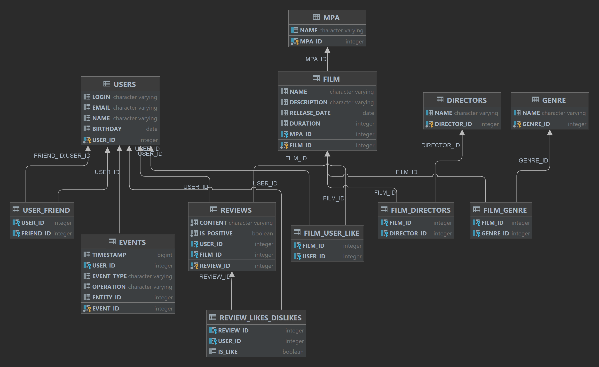

# java-filmorate
Template repository for Filmorate project.

### Taблица ***film***.
Содержит информацию о фильмах.
Пример запроса на получение:

*SELECT * 
FROM film 
WHERE film_id = ?*

### Taблица ***user***.
Содержит информацию о пользователях.
Пример запроса на получение:

*SELECT *
FROM user
WHERE film_id = ?*

### Taблица ***genre***.
Содержит информацию о жанрах фильмов.
Пример запроса на получение всех жанров:

*SELECT *
FROM genre*

### Taблица ***mpa***.
Содержит информацию о возрастных рейтигах для фильма.
Пример запроса на получение всех рейтингов:

*SELECT *
FROM mpa*

### Taблица ***film_genre***.
Содержит информацию о фильмах и их жанрах.
Пример запроса на получение всех жанров конкретного фильма:

*SELECT *
FROM genre AS g 
LEFT JOIN film_genre AS fg ON g.genre_id = fg.genre_id
WHERE fg.film_id = ?
ORDER BY g.genre_id*

### Taблица ***user_friend***.
Содержит информацию о дружбе между пользователями.
Пример запроса на получение списка друзей юзера:

*SELECT *
FROM users AS u
LEFT JOIN user_friend AS uf ON u.user_id = uf.friend_id
WHERE uf.user_id = ?*

### Taблица ***film_user_like***.
Содержит информацию лайках поставленных юзерами фильмам.
Пример запроса на получение списка самых популярных фильмов отсортированный
по убыванию колличества лайков и огранниченный колличеством строк:

*SELECT *
FROM film AS f
LEFT JOIN film_user_like AS ful ON f.film_id = ful.film_id
GROUP BY f.film_id
ORDER BY COUNT(ful.user_id) DESC
LIMIT ?*